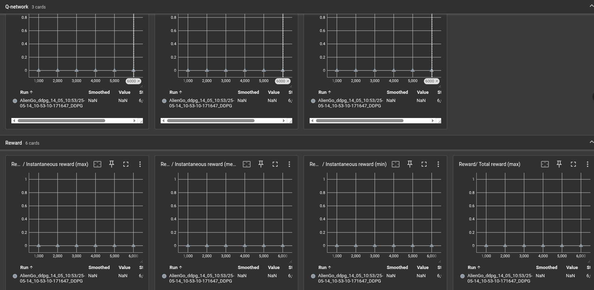

### Parameters Set in aliengo_env
self.sim.dt = 0.002  
self.decimation = 10  
self.sim.render_interval = self.decimation   
self.episode_length_s = 3.0

### From CMD of simulation:
Physics step-size     : 0.002  
Rendering step-size   : 0.02   
Environment step-size : 0.02

same for Taget, Loss (Critic and Policy)